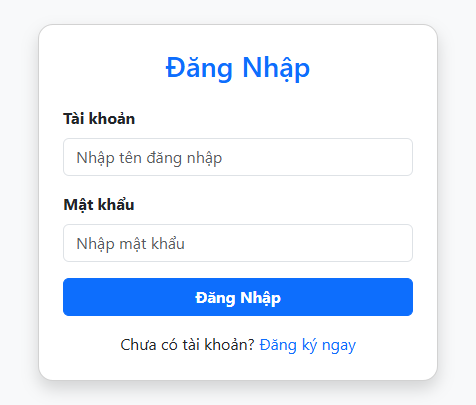
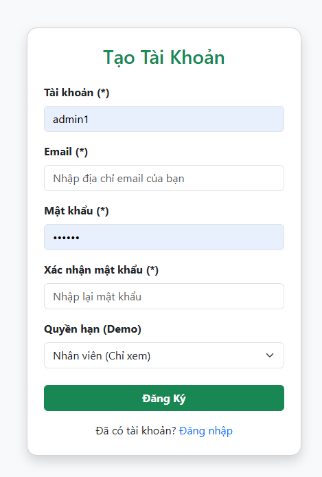
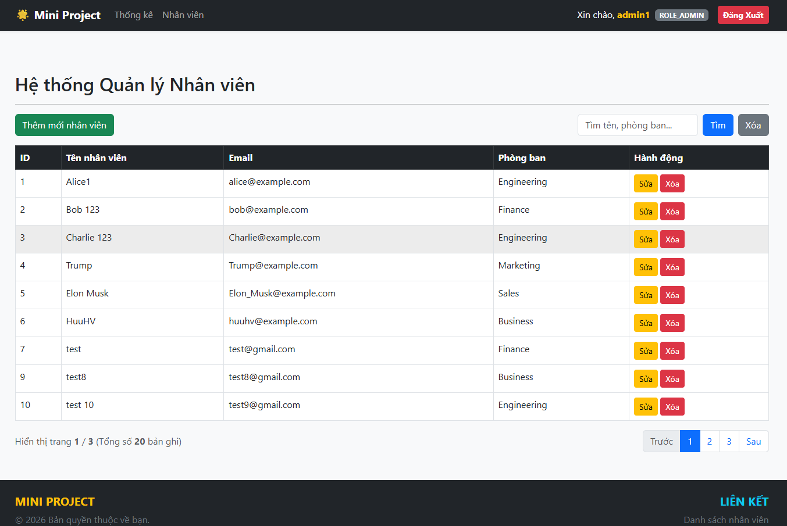
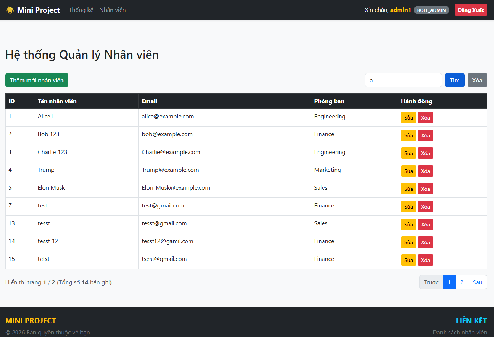
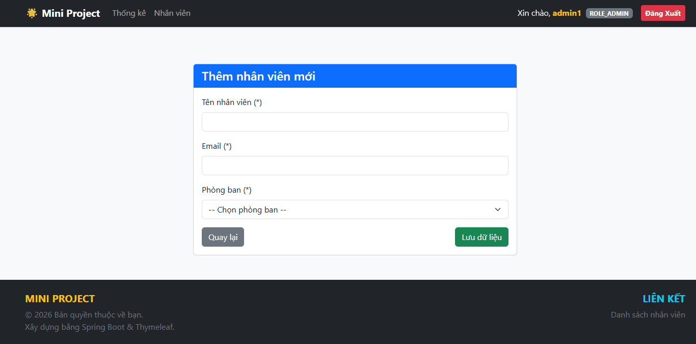
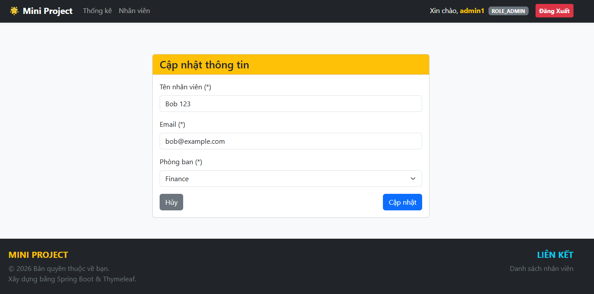
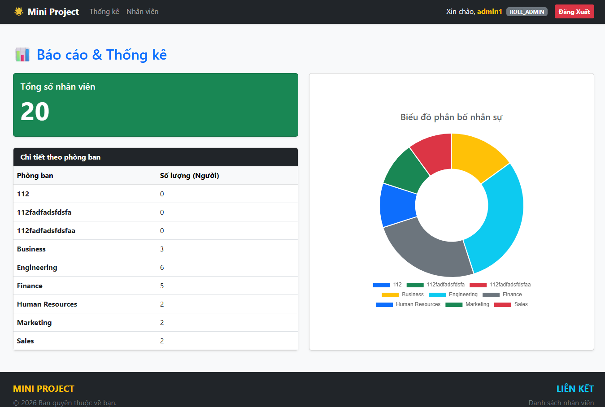
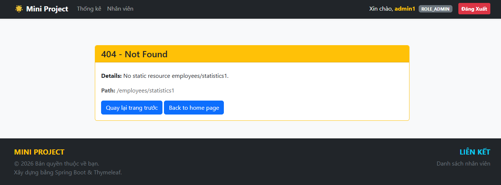

# Spring Mini Project

A full-stack **Spring Boot** application that manages **Departments** and **Employees**.  
It exposes both a **REST API** (JWT-authenticated, stateless) and a **Web MVC interface** (Thymeleaf + session-based form login), with role-based access control for `ROLE_USER` and `ROLE_ADMIN`.

---

## Table of Contents

- [Tech Stack](#tech-stack)
- [Prerequisites](#prerequisites)
- [Quick Start](#quick-start)
- [Project Structure](#project-structure)
- [Configuration](#configuration)
- [Database Migrations](#database-migrations)
- [Default Seeded Data](#default-seeded-data)
- [Web UI — Pages & Links](#web-ui--pages--links)
- [Screenshots](#screenshots)
- [REST API — Quick Reference](#rest-api--quick-reference)
- [Roles & Permissions](#roles--permissions)
- [Caching](#caching)
- [Monitoring (Actuator)](#monitoring-actuator)

---

## Tech Stack

| Layer              | Technology                         | Version        |
|--------------------|------------------------------------|----------------|
| Language           | Java                               | 25             |
| Framework          | Spring Boot                        | 4.0.6          |
| Web               | Spring MVC + Thymeleaf             |                |
| Security           | Spring Security + JWT (JJWT)       | 0.12.6         |
| Database           | MySQL                              | 8.0+           |
| ORM                | Spring Data JPA / Hibernate        |                |
| DB Migration       | Flyway                             |                |
| Cache              | Caffeine (via Spring Cache)        |                |
| Monitoring         | Spring Boot Actuator               |                |
| Build              | Maven                              | 3.9+           |
| Mapping            | ModelMapper                        | 3.2.0          |

---

## Prerequisites

Before running the project, make sure you have the following installed:

| Tool    | Required Version |
|---------|-----------------|
| **JDK** | 25              |
| **Maven** | 3.9+           |
| **MySQL** | 8.0+           |

---

## Quick Start

### 1. Clone the repository

```bash
git clone <repository-url>
cd spring_mini_project/mini_project
```

### 2. Create the MySQL database

```sql
CREATE DATABASE mini_project
  CHARACTER SET utf8mb4
  COLLATE utf8mb4_unicode_ci;
```

### 3. Set environment variables

The application reads credentials from environment variables — **never hardcoded**.

**Windows (PowerShell):**

```powershell
$env:DB_MINI_PROJECT_URL = "jdbc:mysql://localhost:3306/mini_project?useSSL=false&serverTimezone=UTC"
$env:DB_USERNAME          = "root"
$env:DB_PASSWORD          = "your_password"
```

**Linux / macOS:**

```bash
export DB_MINI_PROJECT_URL="jdbc:mysql://localhost:3306/mini_project?useSSL=false&serverTimezone=UTC"
export DB_USERNAME=root
export DB_PASSWORD=your_password
```

### 4. Run the application

```bash
# Linux / macOS
./mvnw spring-boot:run

# Windows
.\mvnw.cmd spring-boot:run
```

The application starts at **[http://localhost:8080](http://localhost:8080)**.  
Flyway will automatically run all pending migrations. Seeders will pre-populate the database on first startup.

---

## Project Structure

```
mini_project/
├── src/main/java/com/huuhv/mini_project/
│   ├── config/              # SecurityConfig, CacheConfig, AppConfig
│   ├── controller/
│   │   ├── api/             # REST API controllers (JSON)
│   │   └── web/             # Web MVC controllers (Thymeleaf)
│   ├── dto/
│   │   ├── request/         # Incoming request DTOs with validation
│   │   └── response/        # Outgoing response DTOs
│   ├── entity/              # JPA entities: Department, Employee, User
│   ├── exception/
│   │   ├── api/             # GlobalExceptionHandler (REST)
│   │   └── web/             # WebExceptionHandler (MVC)
│   ├── repository/          # Spring Data JPA repositories
│   ├── security/            # JwtUtil, JwtAuthenticationFilter, CustomUserDetailsService
│   ├── seeder/              # Startup data seeders (CommandLineRunner)
│   ├── service/             # Business logic services
│   └── task/                # Scheduled tasks (SystemMonitorTask)
├── src/main/resources/
│   ├── db/migration/        # Flyway SQL migration scripts
│   ├── templates/           # Thymeleaf HTML templates
│   ├── application.yml      # Active profile config
│   ├── application-dev.yml  # Dev environment config
│   └── application-prod.yml # Prod environment config
└── pom.xml
```

---

## Configuration

### Profiles

The active profile is set in `application.yml`:

```yaml
spring:
  profiles:
    active: dev   # Change to 'prod' for production
```

### `application-dev.yml` — Key Properties

| Property                          | Environment Variable      | Default         | Description                        |
|-----------------------------------|---------------------------|-----------------|------------------------------------|
| `spring.datasource.url`           | `DB_MINI_PROJECT_URL`     | —               | MySQL JDBC connection URL          |
| `spring.datasource.username`      | `DB_USERNAME`             | —               | Database username                  |
| `spring.datasource.password`      | `DB_PASSWORD`             | —               | Database password                  |
| `jwt.secret`                      | *(hardcoded dev only)*    | 42-char string  | HMAC-SHA signing secret (≥ 32 chars) |
| `jwt.expiration`                  | —                         | `3600000`       | JWT TTL in milliseconds (1 hour)   |
| `management.endpoints.web.exposure.include` | —         | `health,info,metrics,caches` | Actuator endpoints |

> ⚠️ **Production**: always supply `jwt.secret` via an environment variable — never hardcode secrets.

---

## Database Migrations

Flyway runs automatically on startup. Scripts are located in:

```
src/main/resources/db/migration/
├── V20260604100100__create_departments_table.sql
├── V20260604100200__create_employees_table.sql
└── V20260618111000__create_users_table.sql
```

**Schema overview:**

```
departments       employees                users
──────────        ──────────               ──────────
id (PK)           id (PK)                  id (PK)
name (UNIQUE)     name                     username (UNIQUE)
created_at        email (UNIQUE)           email (UNIQUE)
updated_at        department_id (FK)       password
                  created_at               role
                  updated_at               created_at
                                           updated_at
```

---

## Default Seeded Data

On **first startup** (when tables are empty), the application seeds:

### Departments

| ID | Name              |
|----|-------------------|
| 1  | Human Resources   |
| 2  | Finance           |
| 3  | Engineering       |
| 4  | Marketing         |
| 5  | Sales             |
| 6  | Business          |

### Employees

| ID | Name      | Email                    | Department      |
|----|-----------|--------------------------|-----------------|
| 1  | Alice     | alice@example.com        | Human Resources |
| 2  | Bob       | bob@example.com          | Finance         |
| 3  | Charlie   | Charlie@example.com      | Engineering     |
| 4  | Trump     | Trump@example.com        | Marketing       |
| 5  | Elon Musk | Elon_Musk@example.com    | Sales           |
| 6  | HuuHV     | huuhv@example.com        | Business        |

### Users

| Username | Password | Role         |
|----------|----------|--------------|
| `admin`  | `123456` | `ROLE_ADMIN` |
| `user`   | `123456` | `ROLE_USER`  |
| `huuhv`  | `123456` | `ROLE_USER`  |

> Passwords are stored as BCrypt hashes — plain text is only shown here for convenience.

---

## Web UI — Pages & Links

The Web interface uses **form login** (session-based). Open a browser and navigate to:

| URL                                         | Method     | Access              | Description                                |
|---------------------------------------------|------------|---------------------|--------------------------------------------|
| `http://localhost:8080/`                    | GET        | Any                 | Redirects to `/employees/statistics`       |
| `http://localhost:8080/login`               | GET        | Public              | Login page                                 |
| `http://localhost:8080/register`            | GET / POST | Public              | Register a new account                     |
| `http://localhost:8080/logout`              | POST       | Authenticated       | Logout (invalidates session)               |
| `http://localhost:8080/employees/list`      | GET        | USER, ADMIN         | Employee list — search & pagination        |
| `http://localhost:8080/employees/statistics`| GET        | USER, ADMIN         | Statistics — employee count per department |
| `http://localhost:8080/employees/add`       | GET / POST | **ADMIN only**      | Add new employee form                      |
| `http://localhost:8080/employees/edit/{id}` | GET / POST | **ADMIN only**      | Edit employee form                         |
| `http://localhost:8080/employees/delete/{id}`| POST      | **ADMIN only**      | Delete an employee                         |

### Login

Navigate to `http://localhost:8080/login` and use one of the seeded accounts:

```
Username: admin   Password: 123456   (full access)
Username: user    Password: 123456   (read-only access)
```

---

## Screenshots

> 📸 Screenshots below are taken from the running application at `http://localhost:8080`.  
> See [`docs/screenshots/`](docs/screenshots/README.md) for instructions on how to retake them.

---

### 🔐 Login Page

`GET /login` — Public, no authentication required.

- Username / password form with BCrypt-based authentication.
- Displays error alert on wrong credentials.
- Link to the Register page.



---

### 📝 Register Page

`GET /register` → `POST /register` — Public.

- Fields: **Username** (5–50 chars), **Email**, **Password**, **Role** (`ROLE_USER` / `ROLE_ADMIN`).
- Shows inline error if username or email already exists.
- Shows success message upon completion.



---

### 👥 Employee List

`GET /employees/list` — Requires login (`ROLE_USER` or `ROLE_ADMIN`).

- Paginated table: **9 employees per page**.
- Columns: ID, Name, Email, Department, Actions (Edit / Delete — ADMIN only).
- Search bar filters by **employee name** or **department name** (case-insensitive LIKE search).
- Pagination controls with page numbers, Previous / Next buttons.
- **"Add Employee"** button visible only to ADMIN.



**Search result example** (`?keyword=engineering`):



---

### ➕ Add Employee Form

`GET /employees/add` — **ADMIN only**.

- Fields: **Name** (2–100 chars), **Email** (valid format), **Department** (dropdown).
- Shows field-level validation errors inline.
- Redirects to `/employees/list` on success.



---

### ✏️ Edit Employee Form

`GET /employees/edit/{id}` — **ADMIN only**.

- Same fields as Add form, pre-filled with current employee data.
- Email uniqueness check excludes the current employee.
- Redirects to `/employees/list` on success.



---

### 📊 Statistics Page

`GET /employees/statistics` — Requires login (USER or ADMIN).

- Total employee count across all departments.
- Table showing **employee count per department**.
- Default landing page after login (redirected from `/`).



---

### ❌ Error Pages

The application includes custom error pages for common HTTP errors:

| Page         | Template            | Triggered when                                  |
|--------------|---------------------|-------------------------------------------------|
| `404`        | `error/404.html`    | Resource not found (e.g., invalid employee ID)  |
| `405`        | `error/405.html`    | HTTP method not allowed                         |
| `409`        | `error/409.html`    | Duplicate resource (email / department name)    |
| `500`        | `error/500.html`    | Unexpected server error                         |



---

## REST API — Quick Reference

Base URL: `http://localhost:8080/api/v1`

All protected endpoints require:

```
Authorization: Bearer <jwt-token>
```

Get a token by calling `POST /api/v1/auth/login` first.

| Method   | Endpoint                          | Auth              | Description                   |
|----------|-----------------------------------|-------------------|-------------------------------|
| `POST`   | `/api/v1/auth/register`           | 🔓 Public         | Register a new user           |
| `POST`   | `/api/v1/auth/login`              | 🔓 Public         | Login and receive JWT token   |
| `GET`    | `/api/v1/employees`               | USER / ADMIN      | Get all / search employees    |
| `GET`    | `/api/v1/employees?keyword=alice` | USER / ADMIN      | Search by name or department  |
| `GET`    | `/api/v1/employees/report/count`  | USER / ADMIN      | Get total employee count      |
| `POST`   | `/api/v1/employees`               | **ADMIN only**    | Add a new employee            |
| `PUT`    | `/api/v1/employees/{id}`          | **ADMIN only**    | Update an employee            |
| `DELETE` | `/api/v1/employees/{id}`          | **ADMIN only**    | Delete an employee            |
| `GET`    | `/api/v1/departments`             | USER / ADMIN      | Get all departments           |
| `GET`    | `/api/v1/departments/{id}`        | USER / ADMIN      | Get department by ID          |
| `POST`   | `/api/v1/departments`             | **ADMIN only**    | Add a new department          |
| `PUT`    | `/api/v1/departments/{id}`        | **ADMIN only**    | Update a department           |
| `DELETE` | `/api/v1/departments/{id}`        | **ADMIN only**    | Delete a department           |

📖 **Full API reference with request/response examples:** [docs/API.md](docs/API.md)

---

## Roles & Permissions

### Web MVC

| Role         | Accessible Pages                                          |
|--------------|-----------------------------------------------------------|
| `ROLE_USER`  | `/employees/list`, `/employees/statistics`                |
| `ROLE_ADMIN` | All pages — including add, edit, delete employees         |

### REST API

| Role         | Allowed HTTP Methods                                                    |
|--------------|-------------------------------------------------------------------------|
| `ROLE_USER`  | `GET` on `/api/v1/employees/**` and `/api/v1/departments/**`            |
| `ROLE_ADMIN` | All methods: `GET`, `POST`, `PUT`, `DELETE` on all resource endpoints   |

---

## Caching

The application uses **Caffeine** in-memory cache via Spring Cache:

| Cache Name      | What is cached               | TTL      | Eviction               |
|-----------------|------------------------------|----------|------------------------|
| `employeeCount` | Total employee count (Long)  | 1 minute | Scheduled every 60 sec |

Configuration (`CacheConfig.java`):
- **Initial capacity:** 100 entries
- **Maximum size:** 500 entries
- **Expire after write:** 1 minute

Cache statistics are available at:  
`http://localhost:8080/actuator/caches`

---

## Monitoring (Actuator)

Spring Boot Actuator is enabled in the dev profile with the following endpoints:

| Endpoint  | URL                                        | Description                            |
|-----------|--------------------------------------------|----------------------------------------|
| Health    | `http://localhost:8080/actuator/health`    | App + DB connection health status      |
| Info      | `http://localhost:8080/actuator/info`      | Application metadata                   |
| Metrics   | `http://localhost:8080/actuator/metrics`   | JVM, HTTP request, cache metrics       |
| Caches    | `http://localhost:8080/actuator/caches`    | Active cache regions and statistics    |

**Example — check DB health:**

```
GET http://localhost:8080/actuator/health
```

```json
{
  "status": "UP",
  "components": {
    "db": { "status": "UP" },
    "diskSpace": { "status": "UP" }
  }
}
```

> In production, only the `health` endpoint is exposed and `show-details` is set to `never`.
